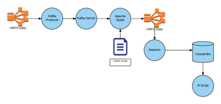

```{r, echo=FALSE, message=FALSE, warning=FALSE}
library(ggplot2)
library(jpeg)
```

# Introduction
The goal of this paper is to analyze the transportation dataset from the US Department of Transport (DOT) Statistics that are hosted as an Amazon EBS volume snapshot and answer a set of interesting questions about them.The dataset contains data and statistics on Aviation up to 2008 in CSV format. It contains flight data such as departure and arrival delays, flight times, etc.

All code and full results can be found at https://github.com/stephendimig/Cloud-Computing-Capstone-Task-2 .

# Methods and Data
## System Installation and Setup
All work for this paper was performed on Amazon Web Services using a virtual machine instance running HortonWorks Sandbox 2.1. An EBS volume was created from a pre-existing snapshot containing the DOT transportation data statistics and attached to the virtual machine. In addition to this basic setup, the Apache Cassandra NoSQL database and the R Programming Language were also installed.

| __Attribute__  | __Value__         | __Description__            |
| :-------------- | :----------------- | -------------------------- |
| Inst. Type     | C3.xlarge         |                            |
| AMI ID         | ami-36d95d5e      | hortonworks 2.1 - sandbox  |
| vCPUs          | 4                 |                            |
| Memory         | 7.5 GB            |                            |
| Inst. Storage  | 128 GB            | Increased the storage size |
| EBS Vol. ID    | snap-23a9cf5e     | BTS transportation data    |
| R              | 3.2               | R programming language     |
| Cassandra      | 2-1.2.10-1        | NoSQL Database             |
| Apache Spark   | 1.3.1             | Real time streaming        |
| Apache Kafka   | 2.11              | Publish Subscribe Messaging|
| Pyspark        |                   | Implementation of Spark     |

For task 2 we will operate on real-time streaming data rather than batch processing it from a file. Apache Spark is a fast and general processing engine compatible with Hadoop data. It is designed to perform both batch processing (like MapReduce) or streaming. Apace Kafka is used to stream our cleaned data set to an Apache Spark process so we can simulate real-time arrival of large quantities of traffic.


| __Language__   | __Description__           |
| -------------- | -------------------------- |
| R              | Used for post processing data filtered by MapReduce |
| Python         | Used in Pyspark as an implementation of Spark programming model |
| cql            | SQL-like query language for Cassandra |

## Apache Spark


The Spark programming model is built around Resilient Distributed Dataset or RDD. Think about RDD as a table in a database. It can hold any type of data. Spark stores data in RDD on different partitions. Programming is Spark involves performing a series of transformations on an RDD such as:

* map - Return a new distributed dataset formed by passing each element of the source through a function.
* filter - Return a new dataset formed by selecting those elements of the source on which func returns true.
* reduceByKey - Returns a dataset of pairs where the values for each key are aggregated using a function.
* sortByKey - Returns a dataset of (K, V) pairs sorted by keys in ascending or descending order.

These operations are pipelined in a series. The overall effect is very much like Lisp. It takes some getting used to, but is very powerful. In no time yo are writing something that looks like this:

```{r eval=FALSE}
my_data = data.filter(lambda p: (flatten([(p[2] == xvals[index] and p[3] == yvals[index] and p[6] < 1200) or (p[2] == yvals[index] and p[3] == zvals[index] and p[6] > 1200) for index in range(0, len(xvals))])))
```



## Group 1 Problems
The Group 1 Problems were solved using Spark SQL instead of the regular RDD operations. This is a nice package that lets you operate on an RDD like an SQL table.

```{r eval=FALSE}
sqlContext = getSqlContextInstance(rdd.context)
row_data = rdd.map(lambda p: Row(airport=p[0], total=int(p[1])))
df = sqlContext.createDataFrame(row_data)
df.registerTempTable("ontime")
handle = sqlContext.sql(""" SELECT * FROM ontime ORDER BY total DESC LIMIT 10 """)
handle.show()
```

This looks great, but it had serious problems with compound keys required later so it had to be abandoned.

## Group 2 Problems
The Group 2 Problems were the most complex as far as integration goes. I could not get the Cassandra/Python interface to work. I tried many different drivers including the TargetHolding pyspark driver, the DataStax pyspark driver, the DataStax python drive, various JDBC drivers and the technique described here:

```{r eval=FALSE}
https://github.com/apache/spark/blob/master/examples/src/main/python/cassandra_outputformat.py
```

I ended up writing the data out in csv format to HDFS and writing a separate python daemon that monitored the directory and imported the csv file into Cassandra. Nothing worked. Interestingly enough I could connect using R and did for problem 3.2.

## Group 3 Problems
For the final problem I used a pyspark script that acts as a course filter to control the data that gets written to the Cassandra database. The pyspark script finds all of the flights from the X destination to the Y that depart before 1200 and all the fights that depart from Y to Z after 1200. Many trips can be combined in to one streaming job like his.

```{r eval=FALSE}
tomstrip.py localhost:2181 airline_ontime "BOS:ATL:LAX" "PHX:JFK:MSP" "DFW:STL:ORD" "LAX:MIA:LAX"
```

A R script then connects to the Cassandra database using a JDBC driver and performs the final analysis. This approach worked well.


# Results
## Group 1 Questions
### 1.1 - Rank the top 10 most popular airports by numbers of flights to/from the airport.
Here are the top 10 airports by total flights.

| __Airport__ | __Description__ |__Flights__ | 
| :----------- | ----------- |----------: |
| ORD | Chicago O'Hare International | 10127492 |
| DFW | Dallas Fort Worth International | 8911953 |
| ATL | Hartsfield Jackson Atlanta International | 8887304 |
| LAX | Los Angeles International | 6253001 |
| PHX | Phoenix Sky Harbor International Airport | 5278040 |
| DEN | Denver International | 4782363 |
| STL | Saint Louis Airport | 4715220 |
| DTW | Detroit Metropolitan Wayne County | 4656124 |
| MSP | Minneapolis-St Paul International | 4314868 |
| SFO | San Francisco International | 4302435

### 1.2 - Rank the top 10 airlines by on-time arrival performance.
Here are the top 10 carriers by average arrival delay. 

| __Carrier__ |  __Description__ | __Avg Delay__ |
| :----------- |  ----------- | ----------: |
| HA           | Hawaiian Airlines, Inc. |  3.852841756072981  | 
| PS           | Ukraine International Airlines | 4.291594182729107  |
| AQ           | 9 Air Co Ltd | 6.202362957707376  |
| OO           | SkyWest Airlines | 7.708825095908175 |
| ML           | Air Mediterranee | 8.518365381892329 |
| B6           | Jetblue Airways Corporation | 8.641935483870968 |
| WN           | Southwest Airlines Co. | 8.643256253039507 |
| NW           | Northwest | 9.641131002163231 |
| PA           | M/S Airblue (PVT) Ltd | 10.189627298902405 |
| US           | Eastern Air Lines Group Inc. | 10.03045200338273 |


### 1.3 - Rank the days of the week by on-time arrival performance.
Here are the top days of the week by average arrival delay. 

| __Day__      | __Avg Delay__ |
| :----------- | ----------: |
| FRI          | 8.881654576311249 |
| MON          | 9.705433406936038 |
| SUN          | 9.759732578135726 |
| SAT          | 10.078778748410985 |
| TUE          | 10.711022339095255 |
| WED          | 12.065425242456921 |
| THU          | 12.718290653527342 |


## Group 2 Questions

### 2.1 - For each airport X, rank the top-10 carriers in decreasing order of on-time departure performance from X.

```{r eval=FALSE}
 origin | carrier | delayavg
--------+---------+----------
    SRQ |      US |   4.6581
    SRQ |      DL |   4.7092
    SRQ |      AA |   4.8585
    SRQ |      NW |   4.9228
    SRQ |      TW |   5.0646
    SRQ |      UA |   5.1712
    SRQ |      EA |   6.8267
    SRQ |      ML |   7.6471
    SRQ |      CO |   8.0175
```

See Appendix A.2.1 for all queries.

### 2.2 - For each airport X, rank the top-10 airports in decreasing order of on-time departure performance from X.
```{r eval=FALSE}
 origin | dest | delayavg
--------+------+----------
    SRQ |  BWI |  0.96419
    SRQ |  MEM |   2.2815
    SRQ |  MSP |   2.4167
    SRQ |  MCO |   2.9848
    SRQ |  RDU |   3.5513
    SRQ |  BNA |   3.5668
    SRQ |  TPA |    4.057
    SRQ |  IAH |   4.1106
    SRQ |  CLT |    4.176
    SRQ |  DCA |   4.3368
```

See Appendix A.2.2 for all queries.

### 2.3 - For each source-destination pair X-Y, rank the top-10 carriers in decreasing order of on-time arrival performance at Y from X. 

```{r eval=FALSE}
origin | dest | carrier | delayavg
--------+------+---------+----------
    LGA |  BOS |      TW |        0
    LGA |  BOS |      PA |   5.4165
    LGA |  BOS |      DL |   7.1603
    LGA |  BOS |      EA |   8.4521
    LGA |  BOS |      AA |       17
    LGA |  BOS |      NW |   21.188
```

See Appendix A.2.3 for all queries.

## Group 3 Questions

### 3.2 - Tom's Unusual Flight
``` {r eval = FALSE}
[1] "BOS -> ATL Flights"
[1] "==================="
     flightno origin dest carrier       date dep_time delay
8502      661    BOS  ATL      DL 2008-04-03      556   556
2397      663    BOS  ATL      DL 2008-04-03      713   713
[1] ""
[1] "ATL -> LAX Flights"
[1] "==================="
     flightno origin dest carrier       date dep_time delay
8745      885    ATL  LAX      DL 2008-04-05     1451  1451
3440       75    ATL  LAX      DL 2008-04-05     1704  1704
2632      125    ATL  LAX      DL 2008-04-05     1842  1842
3868       40    ATL  LAX      FL 2008-04-05     1857  1857
5091       41    ATL  LAX      DL 2008-04-05     1943  1943
5083     1423    ATL  LAX      DL 2008-04-05     2134  2134
8251      535    ATL  LAX      DL 2008-04-05     2206  2206
[1] ""
```

Tom's flight options from BOS->ATL->LAX on 4/3/2008. See Appendix A.3.2 for all queries.

# Discussion
I struggled mightily with this task but somehow got something that worked reasonably well. There was still serious problems though. If I had more time I would investigate the buffering that keeps the process working on data 30 minutes after the Kafka producer has terminated. I do believe this is an issue with parallelization. I would also make an attempt to locate a python JDBC driver since that worked with R. There was some definite data loss going on that I believe was the result of excessive buffering due to the slow response of the Spark program. Running several instances in parallel would have solved this giving higher speed and better reliability. I used global data in a couple of places and this would have to have been modified to run in parallel, but I believe that would have been minor. I did learn quite a bit doing this task and look forward to applying it in the future. 

# Appendix

## A.2.1 For each airport X, rank the top-10 carriers in decreasing order of on-time departure performance from X. See Task 1 Queries for specific queries.

```{r eval=FALSE}
origin | carrier | delayavg
--------+---------+----------
    SRQ |      US |   4.6581
    SRQ |      DL |   4.7092
    SRQ |      AA |   4.8585
    SRQ |      NW |   4.9228
    SRQ |      TW |   5.0646
    SRQ |      UA |   5.1712
    SRQ |      EA |   6.8267
    SRQ |      ML |   7.6471
    SRQ |      CO |   8.0175


 origin | carrier | delayavg
--------+---------+----------
    CMH |      NW |   2.9364
    CMH |      AA |   4.2542
    CMH |      ML |   4.3035
    CMH |      WN |   4.8034
    CMH |      DL |   4.8243
    CMH |      TW |   5.5314
    CMH |      PI |   5.7322
    CMH |      EA |   5.7898
    CMH |      US |   6.5402
    CMH |      AL |   6.5911


 origin | carrier | delayavg
--------+---------+----------
    JFK |      AA |   5.9948
    JFK |      UA |   7.2487
    JFK |      PA |   11.948
    JFK |      DL |   12.129
    JFK |      AL |   12.433
    JFK |      EA |   13.319
    JFK |      US |   13.701
    JFK |      TW |   13.863
    JFK |      NW |   14.301
    JFK |      HP |    15.05


 origin | carrier | delayavg
--------+---------+----------
    SEA |      AS |   4.7947
    SEA |      PS |   4.9827
    SEA |      AA |   5.6609
    SEA |      AL |   6.5102
    SEA |      HP |   6.6635
    SEA |      NW |   6.7731
    SEA |      DL |    6.944
    SEA |      US |   7.4603
    SEA |      CO |   8.0533
    SEA |      UA |   8.3457


 origin | carrier | delayavg
--------+---------+----------
    BOS |      PA |   4.6801
    BOS |      ML |   5.6517
    BOS |      AA |   7.3592
    BOS |      DL |   7.9326
    BOS |      NW |   8.4743
    BOS |      EA |   8.6774
    BOS |      CO |   8.8106
    BOS |      AL |   9.1577
    BOS |      US |   9.7205
    BOS |      TW |    10.41
```

## A.2.2 - For each airport X, rank the top-10 airports in decreasing order of on-time departure performance from X.

```{r eval=FALSE}
origin | dest | delayavg
--------+------+----------
    SRQ |  BWI |  0.96419
    SRQ |  MEM |   2.2815
    SRQ |  MSP |   2.4167
    SRQ |  MCO |   2.9848
    SRQ |  RDU |   3.5513
    SRQ |  BNA |   3.5668
    SRQ |  TPA |    4.057
    SRQ |  IAH |   4.1106
    SRQ |  CLT |    4.176
    SRQ |  DCA |   4.3368


 origin | dest | delayavg
--------+------+----------
    CMH |  MSP |   2.3021
    CMH |  BNA |   2.6359
    CMH |  SDF |   2.9076
    CMH |  DTW |   3.2869
    CMH |  CLE |   3.5629
    CMH |  DFW |    3.862
    CMH |  MEM |   4.0723
    CMH |  ATL |   4.8116
    CMH |  MCO |   4.8323
    CMH |  IND |   4.8381


 origin | dest | delayavg
--------+------+----------
    JFK |  TUS |        0
    JFK |  ISP |        0
    JFK |  PDX |   2.1609
    JFK |  UCA |    2.582
    JFK |  BQN |   2.7293
    JFK |  PSE |   2.9388
    JFK |  STT |   3.1867
    JFK |  SNA |    4.047
    JFK |  BDL |   5.2885
    JFK |  SRQ |    6.125


 origin | dest | delayavg
--------+------+----------
    SEA |  ONT |   3.4235
    SEA |  SJC |   3.5091
    SEA |  PSP |      3.7
    SEA |  SNA |   4.1263
    SEA |  OGG |   4.1628
    SEA |  LGB |   4.5136
    SEA |  GEG |   4.5658
    SEA |  CVG |   4.5953
    SEA |  SLC |   4.6276
    SEA |  SIT |   4.6462


 origin | dest | delayavg
--------+------+----------
    BOS |  SJC |    3.573
    BOS |  LGA |   3.7102
    BOS |  MDW |    5.297
    BOS |  SLC |   5.7681
    BOS |  BDL |   6.2201
    BOS |  SJU |   6.3176
    BOS |  BNA |   6.8922
    BOS |  CVG |   7.2206
    BOS |  RDU |   7.2427
    BOS |  MKE |   7.3931
```

## A.2.3 - For each source-destination pair X-Y, rank the top-10 carriers in decreasing order of on-time arrival performance at Y from X. 

```{r eval=FALSE}
origin | dest | carrier | delayavg
--------+------+---------+----------
    LGA |  BOS |      TW |        0
    LGA |  BOS |      PA |   5.4165
    LGA |  BOS |      DL |   7.1603
    LGA |  BOS |      EA |   8.4521
    LGA |  BOS |      AA |       17
    LGA |  BOS |      NW |   21.188


 origin | dest | carrier | delayavg
--------+------+---------+----------
    BOS |  LGA |      TW |        0
    BOS |  LGA |      DL |   3.4402
    BOS |  LGA |      PA |   8.9278
    BOS |  LGA |      EA |   10.481
    BOS |  LGA |      NW |   19.982
    BOS |  LGA |      AA |       40


 origin | dest | carrier | delayavg
--------+------+---------+----------
    OKC |  DFW |      TW |   3.3499
    OKC |  DFW |      AA |   6.5395
    OKC |  DFW |      DL |    7.524


 origin | dest | carrier | delayavg
--------+------+---------+----------
    MSP |  ATL |      EA |   7.5873
    MSP |  ATL |      DL |   9.2666
    MSP |  ATL |      NW |   10.948
```

## A.3.2 - Tom's Unusual Flight
``` {r eval = FALSE}
[root@sandbox ~]# Rscript group3_2.R BOS ATL LAX "04/03/2008"
[1] "BOS -> ATL Flights"
[1] "==================="
     flightno origin dest carrier       date dep_time delay
8502      661    BOS  ATL      DL 2008-04-03      556   556
2397      663    BOS  ATL      DL 2008-04-03      713   713
[1] ""
[1] "ATL -> LAX Flights"
[1] "==================="
     flightno origin dest carrier       date dep_time delay
8745      885    ATL  LAX      DL 2008-04-05     1451  1451
3440       75    ATL  LAX      DL 2008-04-05     1704  1704
2632      125    ATL  LAX      DL 2008-04-05     1842  1842
3868       40    ATL  LAX      FL 2008-04-05     1857  1857
5091       41    ATL  LAX      DL 2008-04-05     1943  1943
5083     1423    ATL  LAX      DL 2008-04-05     2134  2134
8251      535    ATL  LAX      DL 2008-04-05     2206  2206
[1] ""


[root@sandbox ~]# Rscript group3_2.R PHX JFK MSP "09/07/2008"
[1] "PHX -> JFK Flights"
[1] "==================="
     flightno origin dest carrier       date dep_time delay
7904      118    PHX  JFK      DL 2008-09-07      634   634
4139       12    PHX  JFK      US 2008-09-07      904   904
4923      178    PHX  JFK      B6 2008-09-07     1127  1127
[1] ""
[1] "JFK -> MSP Flights"
[1] "==================="
     flightno origin dest carrier       date dep_time delay
9206      609    JFK  MSP      NW 2008-09-09     1747  1747
[1] ""


[root@sandbox ~]# Rscript group3_2.R DFW STL ORD "01/24/2008"
[1] "DFW -> STL Flights"
[1] "==================="
     flightno origin dest carrier       date dep_time delay
4665     1118    DFW  STL      AA 2008-01-24        0     0
7924     1336    DFW  STL      AA 2008-01-24      657   657
439       314    DFW  STL      AA 2008-01-24      836   836
9136     1030    DFW  STL      AA 2008-01-24      940   940
[1] ""
[1] "STL -> ORD Flights"
[1] "==================="
     flightno origin dest carrier       date dep_time delay
7894      640    STL  ORD      AA 2008-01-26     1452  1452
2110     2245    STL  ORD      AA 2008-01-26     1654  1654
[1] ""


[root@sandbox ~]# Rscript group3_2.R LAX MIA LAX "05/16/2008"
[1] "LAX -> MIA Flights"
[1] "==================="
     flightno origin dest carrier       date dep_time delay
1708      202    LAX  MIA      AA 2008-05-16      708   708
8780      280    LAX  MIA      AA 2008-05-16      817   817
[1] ""
[1] "MIA -> LAX Flights"
[1] "==================="
     flightno origin dest carrier       date dep_time delay
2879      456    MIA  LAX      AA 2008-05-18     1925  1925
9457      972    MIA  LAX      AA 2008-05-18     2101  2101
[1] ""
```
